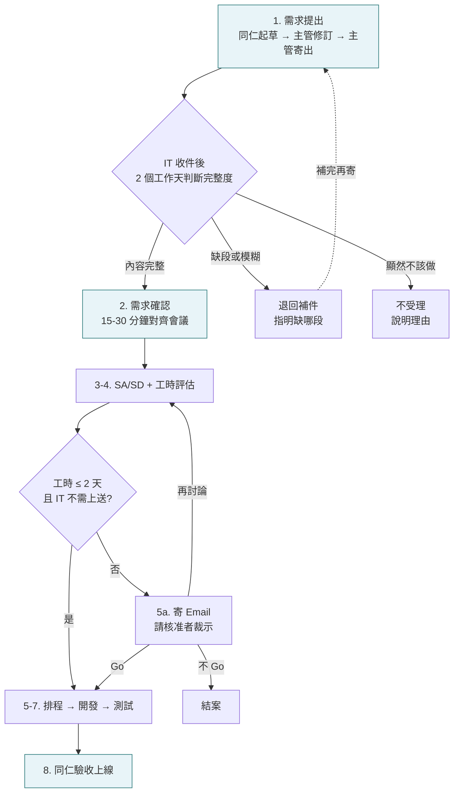

# WitsPer 資訊需求提出指引(試行版)

<!-- [類型/狀態組] -->
> **文件類型**:Guideline
> **狀態**:試行
> **版本**:v1.3
> **最後更新**:2026-05-31
> **本文目的**:規範資訊需求之提出格式 + IT 反饋規範,確保雙邊認知對齊

<!-- [範圍/權威組] -->
> **適用範圍**:全公司同仁向 IT 小隊提出之資訊需求(指需要 IT 動手做的事:新建工具、串接系統、客製化等;不含硬體報修、帳號申請、軟體採購等例行庶務)
> **上位文件**:WitsPer 經營理念、WitsPer 文件寫作手冊
> **承辦單位**:IT 小隊
> **核准者**:依《核決權限表》
> **生效日**:2026-06-01(試行至 2026-07-01)
> **修訂門檻**:依《核決權限表》

<!-- [討論/行動組] -->
> **關聯經營理念**:第三條(機制高於個人)、第六條(透明與說真話)、第九條(組織智慧獨立於個人)
> **討論連結**:[#22 資訊需求提出指引 試行版](https://github.com/witsper-stanley/witsper-operating-cadence/issues/22)
> **下一步**:試行期(2026-06-01 至 2026-07-01)收集全公司使用反饋;期滿評估後決定:(a) 轉為正式 / 微調延長;(b) 升級為線上表單

<!-- [導覽組] -->
> **銜接文件**:WitsPer 文件寫作手冊
> **接手提示**:所有讀者先讀 §1「給誰看,怎麼用」;第一次提需求的同仁加讀 §3;主管加讀 §3.1;IT 同仁加讀 §5「IT 端反饋規範」

————————————————

## §1 給誰看,怎麼用

**給全公司同仁**。當你想請 IT 小隊幫你做以下其中一件事,用本指引格式提 Email 需求:

- 新建工具(自動化腳本、報表、整合)
- 串接系統(API、ERP、平台、GoWarehouse 之間)
- 客製化(現有工具加新功能)

下列**不走本指引**,直接找 IT 小隊:硬體報修、帳號申請 / 權限調整、軟體採購 / 授權。

### 三步快速使用

| 步驟 | 需求方動作 | 結果 |
|:---:|---|---|
| 1 | 用 §3 六段格式寫 Email 初稿,寄給直屬主管;主管修訂後寄到 IT@witsper.com(CC 提出方) | Email 進到 IT |
| 2 | 等 IT 回覆(2 個工作天內) | IT 回 **受理** / **退回補件** / **不受理**(詳 §4 + §5) |
| 3 | 受理後出席 15-30 分鐘需求確認會議,IT 評估、排程、開發後由提出方驗收 | 進度通知由 IT 主動發(詳 §6) |

> **本指引目前處於試行期**(2026-06-01 至 2026-07-01)。試行期間有任何使用上的疑問或建議,告知 IT 小隊主管(詳 §7)。

————————————————

## §2 一個資訊需求從提出到上線會走 8 個階段

本指引規範前 2 個階段(同仁參與)與 IT 收件後的反饋(§5),後續 6 個階段由 IT 小隊內部跑:

| 階段 | 內容 | 同仁角色 |
|---|---|---|
| 1 | 需求提出 | 同仁起草、主管寄出(§3) |
| 2 | 需求確認 | 同仁配合對齊細節(§4) |
| 3 | SA / SD(系統分析與設計) | 等通知 |
| 4 | 風險評估 / 工時評估 | 收到評估結果 |
| 5 | 排程 | 收到排程通知 |
| 6 | 開發 | 等通知 |
| 7 | 測試 | 等通知 |
| 8 | 上線 / 驗收 | 同仁驗收 |

### 圖示流程

藍框為同仁實際參與的環節(階段 1、2、8)。工時 ≤ 2 個工作天且 IT 不上送時,跳過核准直接進排程。

————————————————

## §3 第 1 階段:需求 Email 怎麼寫

### 3.1 流程:同仁起草、主管寄出

同仁先寫好需求 Email 初稿 → 寄給直屬主管 → 主管修訂 → 主管寄出。

由主管寄出,自帶「主管已同意此需求」的意義;不另設批准簽核。

### 3.2 收件人 / CC 規則

- **收件人**:IT@witsper.com
- **CC**:提出需求的同仁本人
- **主旨格式**:`[資訊需求] 一句話描述要解的問題`
  - 範例:`[資訊需求] 每週 104 履歷整理花太久`

### 3.3 Email 內容:六個必要段落

**附件是補充材料,六段仍寫**。Email 六段提供 IT 評估可行性與工時所需的 context;附件規格再完整也無法取代六段描述。

一封好的需求 Email,IT 看完應該能回答:這個需求是什麼、目前怎麼做、痛在哪、希望變成什麼樣、誰會用、什麼時候要。具體寫六段:

#### (1) 一句話描述要解的問題

描述「問題」,不寫「解決方案」。

| 好 | 不好 |
|---|---|
| 每週整理 104 履歷要花 2 小時,常常複製錯 | 想做一個自動抓履歷的工具 |

理由:如果第一句寫成解決方案,後面的描述會跟著用「解決方案」的思路,IT 看不到真正的問題,可能漏掉更簡單的解法。

#### (2) 現在實際上怎麼做這件事

條列真實的操作步驟。1, 2, 3, 4...... 越具體越好。再附上每次花多久、多常做。

| 好 | 不好 |
|---|---|
| 1. 打開 104 後台 2. 一份一份點開履歷 3. 複製姓名、學歷、經歷貼到 Notion 4. 手動加標籤 5. 寄信通知用人主管  每次約 2 小時,每週一次 | 就是把履歷整理進系統,每週都要做 |

#### (3) 現在的流程裡最痛苦的點

條列真實痛點。寫「現在哪裡卡住、出錯、浪費時間」,不寫「我想要什麼功能」。

| 好 | 不好 |
|---|---|
| 1. 複製貼上容易漏字或貼錯欄位 2. 同一份履歷有時收到三次,要手動去重 3. 用人主管收到通知常常忘記回覆,要追 | 沒有自動化 |

#### (4) 解決後希望的狀態

用這個句型:「當 ___ 時,我希望能 ___,這樣我就能 ___。」

範例:當 104 有新履歷進來時,我希望系統能自動整理進 Notion 並通知用人主管,這樣我就能把每週省下的 2 小時花在面試上。

#### (5) 使用者與規模

列出會用這套東西的角色、部門、人數。預估每次能節省多少時間。

範例:HR 大隊 3 人 + 用人主管 5 人。預估每週省 2 小時。

#### (6) 期望完成時間

| 選項 | 補充說明 |
|---|---|
| 一週內 | 在 Email 中說明原因(例:客戶活動已定 X 月 X 日) |
| 兩週內 | 不需補充 |
| 一個月內 | 不需補充 |
| 不急,IT 排程 | 不需補充 |

### 3.4 附件(選填)

附上目前流程的截圖、想參考的工具範例、相關文件、規格清單。一張好截圖勝過 500 字描述。

附件是補充,Email 六段仍寫。

————————————————

## §4 第 2 階段:IT 發起需求確認後,同仁配合什麼

主管寄出 Email 後,IT 小隊在 2 個工作天內回覆。Email 內容完整則排定需求確認(15-30 分鐘的對齊會議,視訊或面談);不完整則先退回補件(IT 端規範詳 §5)。

**需求確認是制度上的必經之路**。Email 把需求描述到約 70%,剩下 30% 靠對齊把細節釐清——可行性、技術約束、優先順序、驗收標準。

### 4.1 同仁在需求確認時要做的事

- 提需求的同仁出席(主管視情況到)
- 帶上原始 Email 與相關附件
- 回答 IT 的提問;現場答不出來的,會後補上

### 4.2 需求確認後 IT 的回覆

IT 用 Email 回覆結論,三種可能:

| 結論 | 同仁要做的事 |
|---|---|
| 進入第 3 階段(SA/SD) | 等通知,IT 會給工時評估 |
| 需求調整後再評估 | 依 IT 建議調整,進新一輪確認 |
| 不受理 | IT 回覆中說明理由(例:有現成工具、成本不對等) |

————————————————

## §5 IT 端反饋規範

本節給 **IT 小隊同仁**:收到資訊需求 Email 後,如何在 2 個工作天內回覆。

### 5.1 收件後的第一個動作:判斷完整度

IT 收到 Email 後,先檢查:

- 六段是否齊全
- 描述是否能讓 IT 在不問問題的情況下判斷可行性與工時

依結果走三條路:

| 完整度 | 動作 | 詳見 |
|---|---|---|
| 六段齊全且能評估 | 排定需求確認會議 | §5.3 |
| 缺段或描述模糊 | 退回補件 | §5.2 |
| 顯然不該由 IT 做 | 不受理 | §5.4 |

### 5.2 退回補件的回覆內容

退回補件信明確指出三件事:

1. **缺哪段**:具體點出六段中哪幾段沒寫(或寫得不完整)
2. **為什麼缺這段會擋住評估**:讓需求方理解此段對評估的必要性
3. **補完哪些可再送**:給出明確的下一步

範例:

> 你好,
>
> 收到資訊需求,但無法直接進入評估,需要補充以下:
>
> 1. **現在實際怎麼做**:目前只寫「對齊 BI 與帳務差異」,沒有實際對帳的步驟。缺這段我無法判斷是流程問題、資料問題、還是邏輯問題。
> 2. **期望完成時間**:沒有寫,影響排程判斷。
>
> 補完這兩點再寄一次即可。
>
> — IT 小隊

### 5.3 受理(排定需求確認)的回覆內容

受理信包含:

- **確認會議時間**:具體日期與時段(2-3 個選項供需求方挑)
- **誰要到**:預設提需求的同仁出席;主管視情況
- **請帶什麼**:原始 Email、附件、相關截圖
- **預估會議長度**:15-30 分鐘

### 5.4 不受理的回覆內容

不受理信包含:

- **理由**:寫清楚。例:「現有的 X 工具能解,不需要 IT 開發」、「成本不對等,評估非優先」、「需求屬於 Y 部門權責範圍」
- **替代方案**:如果有,盡量提

### 5.5 工時評估完成後:IT 自決門檻

IT 完成工時評估後,依工時決定下一步:

- **工時 ≤ 2 個工作天** → IT 自行決定開工
- **工時 > 2 個工作天** → 寄 Email 給核准者(試行階段 = COO)請核准者回覆 Go / 不 Go

即便工時 ≤ 2 天,若 IT 認為有寄信請示之必要(例:資源排擠、優先順序衝突、影響需高層裁示),仍可主動寄。這是 IT 的判斷權。

### 5.6 給核准者的 Email 該寫什麼

工時 > 2 個工作天或 IT 主動上送時,寄一封 Email 給核准者,內文包含:

- 需求摘要(1 句話)
- 預估工時(人天)
- 預計開工日 + 預計完成日
- 影響範圍 / 預期效益(誰會用、能省什麼)
- 是否排擠現有 IT 工作(是 → 列出排擠項)
- IT 建議:**Go / Hold / 不建議**(附簡短理由)

核准者 reply 回覆:**Go / 不 Go / 再討論**。預期回覆時間 2-3 個工作天內。

————————————————

## §6 第 3-8 階段:同仁會看到什麼

第 3-8 階段(SA/SD、風險評估、排程、開發、測試、上線驗收)由 IT 小隊內部跑。同仁在以下時點收到 IT 的通知:

- **工時評估完成**
  - 工時 ≤ 2 天 → IT 直接告知預計交付時間
  - 工時 > 2 天(或 IT 主動上送) → IT 告知「已寄信給核准者請示」
- **核准結果**(僅需上送的需求)
  - Go → IT 告知預計開工日
  - 不 Go → IT 告知理由;同仁可依理由調整後重提
  - 再討論 → IT 約再評估,同仁配合
- **排程確認** → IT 通知預計開工日
- **開發完成** → IT 邀請驗收
- **驗收通過** → 正式上線

需求變更、優先順序變動,直接 reply 原始 Email 串告訴 IT。

————————————————

## §7 試行期反饋管道

試行期間,以下情況請告知 IT 小隊主管:

- 某個段落不知道怎麼填
- IT 來回追問同樣的問題很多次
- 某個流程環節卡住超過 3 個工作天
- 對本指引有任何改進想法

試行期滿(2026-07-01),IT 小隊整理反饋並決定下一階段。

————————————————

## §8 為什麼有這份指引(背景)

過去資訊需求的提出方式分散在 Slack、口頭、Email、面談多個管道;IT 收到時常缺少關鍵資訊,後續來回追問、認知落差、重工。本指引把「一份需求該長什麼樣」「IT 該如何反饋」雙邊都寫清楚,讓需求進到 IT 時資訊充足、雙方對齊有節奏。

試行期滿後,依運作結果決定:

- 順暢 → 期滿轉為正式
- 仍有摩擦 → 修訂本指引、延長試行
- Email 形式穩定後 → 升級為線上表單
- 線上表單穩定後 → 轉為正式 SOP

————————————————

## 變更紀錄

| 版次 | 日期 | 修訂摘要 |
|---|---|---|
| v0.1 | 2026-05-17 | 初步骨架,涵蓋階段 1(需求提出)與階段 2(需求確認) |
| v0.9 | 2026-05-17 | Email 試行版草稿(接近發布)。涵蓋階段 1(需求提出)、階段 2(需求確認);§3.3 附件主義;§4 加入完整度判斷分流;§5 IT 端反饋規範含 §5.5 工時 2 天 IT 自決門檻、§5.6 給核准者的 Email 內容;Mermaid 圖示流程含核准分支;適用範圍限定財務部門試行 |
| v0.10 | 2026-05-29 | 入 repo 時 ship 對齊:(1) Sidecar 核准者 / 修訂門檻 → 依《核決權限表》(對齊 v4.21);(2) 本文目的 trim 至 27 字(符合 Sidecar Standard ≤30 字規格);(3) §5.5「Stanley」→「COO」、§7「Key」→「COO 特助」(對齊「不寫個人姓名」規則 v3.1);(4) 填 #22 討論連結;(5) 補 💬 留言 footer |
| v0.11 | 2026-05-30 | §3.2 IT 接收信箱填上「IT@witsper.com」(原 [待填] placeholder 清掉)。Promote v1.0 試行的最後 blocker 解除。 |
| v0.12 | 2026-05-30 | **檔名 / title 簡化**:「Email 試行版」→「試行版」(階段細節「Email vs 線上表單」屬內部演進 paradigm,不在公告 name 上 surface;body 內「需求 Email 怎麼寫」這類 channel 描述仍保留)。Sidecar 討論連結 wording 同步;Issue #22 title 同步。**試行日期 sync**:5/18 → 6/1、6/18 → 7/1(對應 6/1 公告日)。|
| **v1.0** | **2026-05-30** | **首次正式公告**(Version 1)。狀態 草稿 → 試行;生效日 2026-06-01;試行至 2026-07-01(財務部門限定試行)。對應公佈紀錄 §3 entry。|
| v1.1 | 2026-05-30 | **公告前 wording sweep**(對齊《文件寫作手冊》v0.5 新增地雷 7「不信任 / 批評性 wording」):(1) 適用範圍從財務部門擴為全公司(Stanley 確認一開始就全公司);§1 試行期滿後決定移除「擴大全公司」階段;(2) §3.3 開頭「附件不是替代品... IT 只會退回」→ 中性「附件是補充材料,六段仍寫」;(3) §3.4 「再次提醒...不代表正文可省略」→「附件是補充,六段仍寫」;(4) §4 「不是 IT 對個別需求有疑慮」拿掉;(5) §4.1「如實回答」→「回答」;(6) §5.2「不是刁難」→「此段對評估的必要性」;(7) §5.5「尊重 IT 專業判斷」「非例外條款」defensive wording 拿掉;(8) §7 反饋管道「COO 特助」→「IT 小隊主管」。|
| v1.2 | 2026-05-31 | **reader-friendly restructure**(Stanley audit:「初級同仁打開不知道這個辦法究竟是做什麼、怎麼跟 IT 提需求」):(1) 新加 §1「給誰看,怎麼用」⸺ friendly intro(給誰 / 提什麼需求 / 不走本指引的情況)+ 三步快速使用表格 + 試行期 alert;(2) 原 §1「試行期與背景」(paradigm-level 背景說明)拆分:具體試行宣告併入新 §1 末尾 alert,背景說明(過去 pain point + 4 條 evolution path)順移末尾改名 §8「為什麼有這份指引(背景)」;(3) §2-§7 其他章節 numbering 不變(沒被 cross-reference,safe rename);(4) Sidecar「接手提示」同步改「所有讀者先讀 §1」。對齊《文件寫作手冊》§二 Guideline 容許敘事 paradigm。|
| v1.3 | 2026-05-31 | §1「三步快速使用」表格 wording 行政化:column header「步」→「步驟」、「你做的事」→「需求方動作」;cell 內「你 / CC 你 / 你驗收」改 generic「提出方 / CC 提出方 / 由提出方驗收」。§1 提需求類別「CRM」→「平台、GoWarehouse」(內部實際使用的系統)。|

————————————————

## 💬 留言 / 提問

**👉 [到 Issue #22 留言](https://github.com/witsper-stanley/witsper-operating-cadence/issues/22)**

不需 git 知識 ⸺ 登入 GitHub 帳號,在 Issue 下方輸入框打字 → Comment。
留言永久開放,作為這份檔的長期討論室。

————————————————

v1.3 試行 ｜ 2026-05-31 ｜ WitsPer 資訊需求提出指引(試行版) (Guideline)
